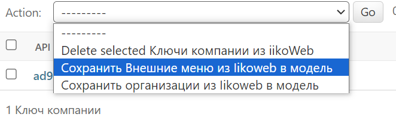

# delivery_service

## Поднятие докерфайла:
- docker-compose -f docker-compose.prod.yaml up --build
- docker-compose -f docker-compose.prod.yaml exec web python backend/manage.py migrate
- docker-compose -f docker-compose.prod.yaml exec web python backend/manage.py collectstatic
- docker-compose -f docker-compose.prod.yaml exec web python backend/manage.py csu

## Поднятие фронта:
- cd .\frontend\
- docker build -t frontend-image .
- docker run -d -p 80:80 frontend-image

## Ручки для обновления БД товарами:
Реализовано следующим образом (самих ссылок в админке нет, только через строку переход):
1) Админ добавляет в модель Ключи компании из iikoWeb API key из лк iiko
2) делает запрос на сервер через action "Сохранить внешние меню"  — получаем айдишники меню

3) делает запрос на сервер через action "Сохранить организации" — получаем айдишники организаций
4) делает запрос по ссылке домен/admin/admins/iikoapikey/save-menu/ — здесь есть шаблон, куда админ должен ввести нужное ему меню (id) и организацию (id) и нажать на активную кнопку для получения всех категорий и товаров этой организации и меню. В этот момент происходит update_or_create для всех записей в категориях и продуктах

x