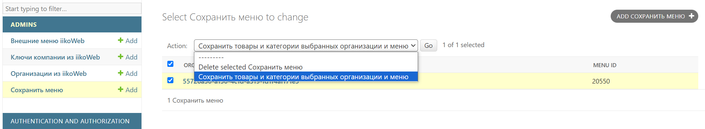

# delivery_service

## Поднятие докерфайла:
- docker-compose -f docker-compose.prod.yaml up --build
- docker-compose -f docker-compose.prod.yaml exec web python backend/manage.py migrate
- docker-compose -f docker-compose.prod.yaml exec web python backend/manage.py collectstatic
- docker-compose -f docker-compose.prod.yaml exec web python backend/manage.py csu

## Поднятие фронта:
- cd .\frontend\
- docker build -t frontend-image .
- docker run -d -p 80:80 frontend-image

## Ручки для обновления БД товарами:
Реализовано следующим образом (самих ссылок в админке нет, только через строку переход):
1) Админ добавляет в модель Ключи компании из iikoWeb API key из лк iiko
2) делает запрос на сервер через action "Сохранить внешние меню"  — получаем айдишники меню

3) делает запрос на сервер через action "Сохранить организации" — получаем айдишники организаций
4) переходит в раздел "Сохранить меню" и создаёт новый объект ("Add Сохранить меню" в правом верхнем углу), где использует уже загруженные Внешнее меню и Организацию
5) Выбирает созданный объект и выбирает action Сохранить товары... и жмёт кнопку Go. Обновление занимает около 1,5 минуты (картинки загружаются из интернета в каждый продукт, где они есть)
 
